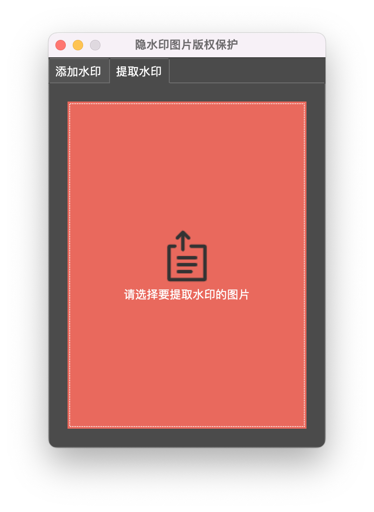
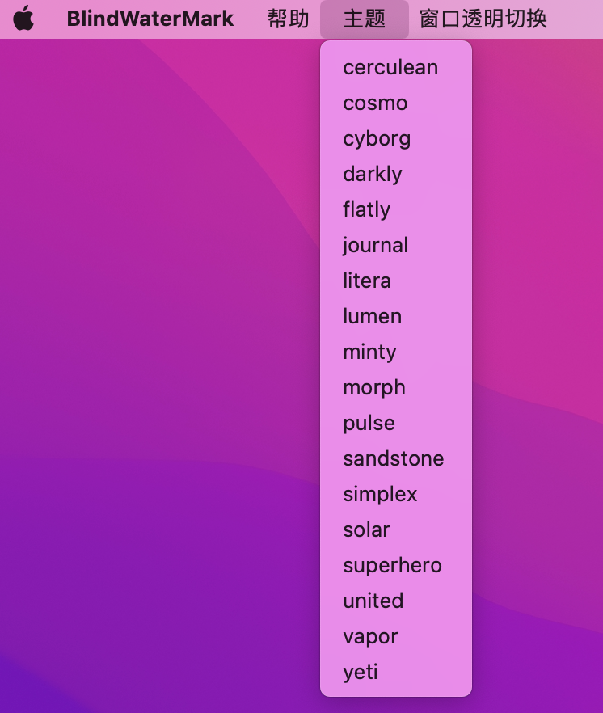
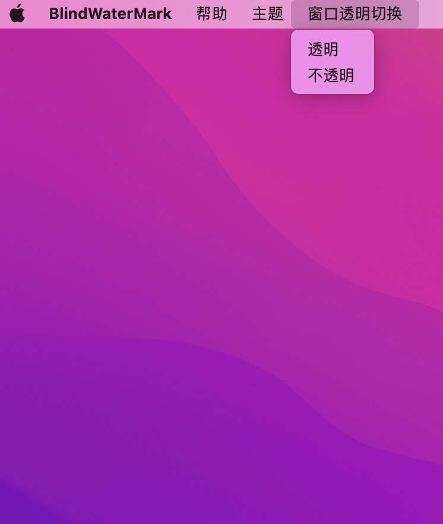

# BlindWaterMark

Blind&amp;Invisible Watermark ，图片盲水印桌面GUI，对[blind-watermark](https://github.com/guofei9987/blind_watermark)文本模式的改造和GUI封装。

## 下载安装

+ Mac(amd64):
+ Windows:

**注意⚠️**：因为有个自解压的过程，第一次启动相对较慢,之后就正常了。

## 截图展示

**开始**

**添加水印**

**提取水印**

**更改主题**

**窗体透明与否切换**

**关于**

